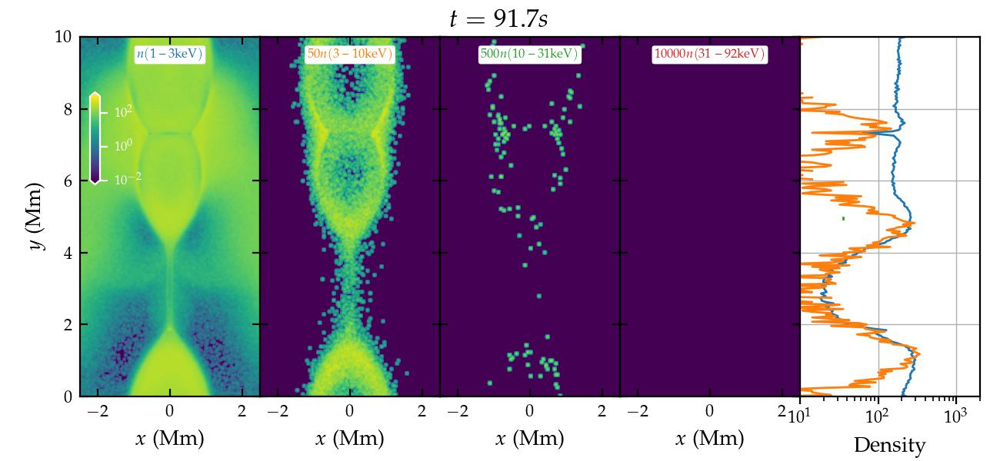

Usage
=====

Here we use a 2D reconnection problem as an example. The relevant code and scripts are in ``examples/reconnection_2d``.

MHD simulation
--------------
Please follow the instruction in `athena_reconnection <https://github.com/xiaocanli/athena_reconnection>`__ to run a reconnection simulation with two current sheets and periodic boundary conditions. The input file for the Athena++ simulation is ``code/athinput.reconnection`` in `athena_reconnection <https://github.com/xiaocanli/athena_reconnection>`__. The simulation domain size is [0, 2] :math:`\times` [0,2]. The grid size is :math:`1024\times1024`. The simulation will last 20 Alfven-crossing time and produce 200 frames of data of the primary variables (``reconnection.prim*.athdf``) in default.

Reorganize the MHD data
-----------------------
Instead of directly processing the data from different MHD codes (e.g., VTK files by Athena and HDF5 files by Athena++) in the simulations, we will reorganize the MHD simulation outputs using Python scripts first. The example scripts for Athena and Athena++ outputs are in ``mhd_data``. There is a shell script ``reorganize_data.sh`` for running the Python scripts with commandline arguments.

.. code:: sh

   ./reorganize_data.sh

which will include 2 ghost cells at each boundary according to the boundary conditions (periodic or open).

.. note::

    Due to their stochastic nature, the pseudo particles can cross the local domain boundaries multiple times in a short time, significantly increasing the MPI communication cost. We choose two ghost cells to enable particles to stay in the local domain when they are near the boundaries. The two ghost cells also make calculating the gradients of the fields easier at the boundaries. **This could be improved in the future**.

The script will generate the MHD fields (in bindary format) and the simulation configuration needed for the transport modelings in ``bin_data`` under the MHD run directory.

    -  ``mhd_data_*``: :math:`v_x, v_y, v_z, \rho, B_x, B_y, B_z, B`, which have a size of :math:`1028\times1028`.
    -  ``rho_*``: plasma density (:math:`1028\times1028`)
    -  ``pre_*``: plasma pressure (:math:`1028\times1028`)
    -  ``mhd_config.dat``: the MHD configuration information. See the function ``save_mhd_config`` in ``mhd_data/reorganize_fields.py`` for the details of the configuration.

Particle transport modeling
---------------------------

Calculating :math:`\kappa_\parallel`
~~~~~~~~~~~~~~~~~~~~~~~~~~~~~~~~~~~~

Before transport modeling, we need to calculate the parallel diffusion coefficient :math:`\kappa_\parallel` using the simulation normalizations (length scale, magnetic field, plasma density, turbulence amplitude and anisotropy). There is a Python script ``sde.py`` for doing that. The default parameters are ideal and similar to those used in [1]_. Running the script will give a set of parameters. We will only need ``Normed kappa parallel`` for now, which is 7.419363e-03 in default.

Running the simulation
~~~~~~~~~~~~~~~~~~~~~~

- Go the the directory (e.g., ``$SCRATCH/transport_test``) where you link the executable ``stochastic-mhd.exec``.
- Create a directory ``config`` under ``transport_test`` and copy ``conf.dat`` and ``diffusion_reconnection.sh`` in ``stochastic-parker/examples/reconnection_2d`` into ``config``.
- Change ``kpara0`` in function ``stochastic ()`` in ``diffusion_reconnection.sh`` to the value calculated above.
- Change ``mhd_run_dir`` and ``run_name`` (at the bottom of ``diffusion_reconnection.sh``) to your choices.

You will notice that there are many input parameters, some of which are through ``conf.dat``, and the others are through command-line arguments.

.. note::

    The command-line arguments are from the earlier design. As the program evolves, more and more command-line arguments are needed, making it tedious to run the simulation. **In the future, it will be better to put some of the command-line arguments into a configuration file (e.g., conf.dat).**

To check all the available command-line arguments,

.. code:: sh

    srun -n 1 ./stochastic-mhd.exec -h

Or you can check the comments in ``diffusion_reconnection.sh``. For this test run, you don't need to change these input parameters. The default name of the transport run is ``transport_test_run``. We can request an interactive node to run the test, for example, on Cori@NERSC,

.. code:: sh

    salloc -N 1 -q interactive -C haswell -t 04:00:00 -L SCRATCH
    module load cray-hdf5-parallel
    ./diffusion_reconnection.sh

It will take about one hour to run the simulation. The output files are in ``transport_test/data/test_periodic_bc/transport_test_run/``.

    - ``fdpdt-*.dat``: the energization rate (only the compression is included for now).
    - ``fp-*.dat``: the global momentum distributions.
    - ``fp_local-*.dat``: the local momentum distributions.
    - ``fxy-*.dat``: the local particle densities in different energy bands. They are similar to ``fp_local-*.dat`` but only for a few energy bands.
    - ``quick.dat``: the parameters to diagnose the simulation status during runtime.
    - ``pmax_global.dat``: the maximum momentum at the same time frames in ``quick.dat``.

Plotting the results
~~~~~~~~~~~~~~~~~~~~

The relevant files for plotting are in ``examples/reconnection_2d/vis``. Please copy the files to a directory of your choice for data analysis, for example, ``$SCRATCH/transport_test/python``. Please also copy ``python/sde_util.py`` into the same directory. We will use the Jupyter notebook ``transport_test.ipynb`` to plot the results. The notebook needs information about the MHD simulation (``mhd_runs_for_sde.json``) and the SDE run (``spectrum_config.json``).

.. note::
    
    The two JSON files will keep tracking the information of MHD runs and the SED runs for each MHD simulation, respectively. We recommend keeping the records in this kind of JSON file.
    
For ``mhd_runs_for_sde.json``, please change ``run_dir`` to your reocnnection simulation directory. In ``spectrum_config.json``,

    - ``run_name``: a unique name for the SDE run starting from the MHD run name
    - ``nreduce``: the reduce factor of the spatial distribution. It should be the same as that in ``conf.dat``. It is 8 in default so the spatial distribution has a size of :math:`128\times128`.
    - ``e0``: the energy normalization in keV (default: 10 keV)
    - ``xlim_e``, ``ylim_e``: the limites for the energy spectrum plots

The rest of the parameters in ``spectrum_config.json`` are not commonly used and will be deprecated in the future.

After running the Jupyter notebook, you will get the time evolution of the global energy spectrum

and the spatial distributions of local particle distributions at the final time step.

Both the spectra and the spatial distributions show that the acceleration is weak. The reason is that the compression in the MHD simulation is not strong. The acceleration will be stronger in MHD simulations with higher Lundquist numbers and resolutions.

.. [1] Large-scale Compression Acceleration during Magnetic Reconnection in a Low-β Plasma, Xiaocan Li, Fan Guo, Hui Li, and Shengtai Li, `The Astrophysical Journal` Oct 2018